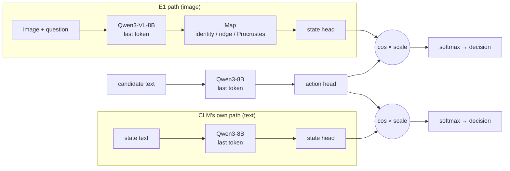
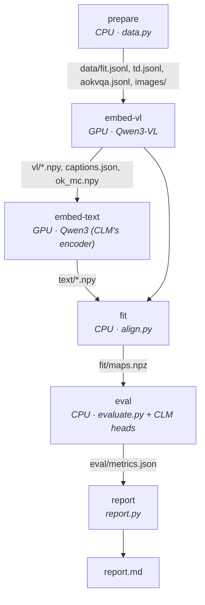
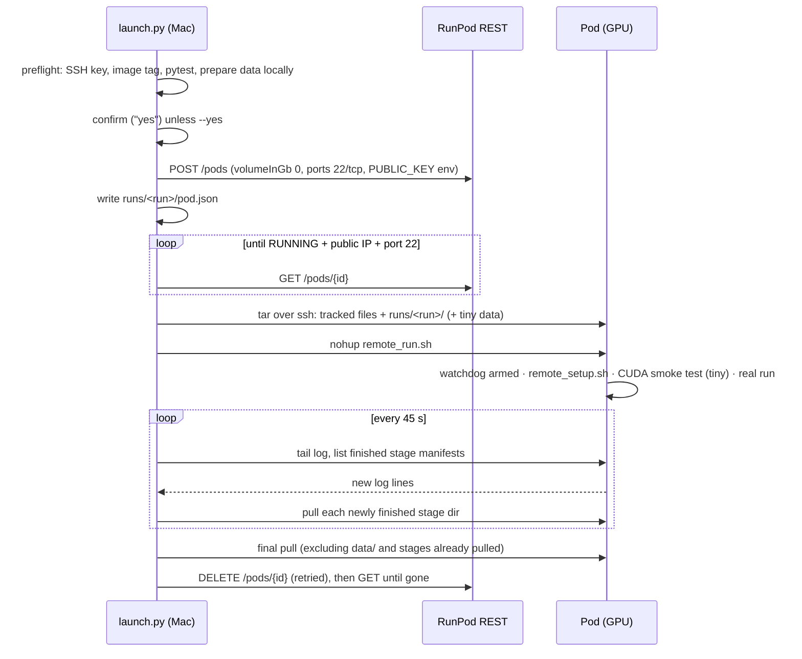

# Code walkthrough

A guided tour of the CVLM codebase in the order data flows through it. Read it top to bottom once. After that,
the section headers work as an index. Links with `#L…` point at the current commit and drift as the code changes;
the function names don't.

**Contents:**
1. [The idea in code](#1-the-idea-in-code)
2. [Repository map](#2-repository-map)
3. [The pipeline](#3-the-pipeline)
4. [Module by module](#4-module-by-module)
5. [RunPod layer](#5-runpod-layer)
6. [Tests](#6-tests)
7. [Configs](#7-configs)
8. [Design decisions worth knowing](#8-design-decisions-worth-knowing)
9. [Extending it](#9-extending-it)

---

## 1. The idea in code

CLM-8B scores a candidate action `a` for a state `s` like this:

```
e_s = normalise(Qwen3-8B(s)[last token])          # 4096-d, the hidden state after the final norm
e_a = normalise(Qwen3-8B(a)[last token])
score(s, a) = exp(logit_scale) * cos(state_head(e_s), action_head(e_a))   # heads: 4096 → 512 MLPs
answer distribution = softmax over the candidates' scores
```

E1 asks whether an image state can enter that formula through a vision-language model instead:

```
e_s' = normalise(Map(Qwen3-VL-8B(image + question)[last token]))   # Map: VL space → Qwen3-8B space
score(s, a) = exp(logit_scale) * cos(state_head(e_s'), action_head(e_a))
```

The code produces the embeddings for both models, fits `Map` on text only, and compares the image-driven decisions
against baselines. Every piece below serves one of those three steps.



---

## 2. Repository map

```
cvlm/                      the library: everything that computes something
  config.py                  Config dataclass, YAML + --set overrides, pinned dataset revisions
  clm_src.py                 imports from the pinned CLM checkout (schema, heads, train/adapters)
  data.py                    stage `prepare`: fit corpus, typed-decisions eval, A-OKVQA eval + images
  encoders.py                last-token embeddings for Qwen3 and Qwen3-VL; captions; multiple-choice logits
  align.py                   maps from the VL space into CLM's encoder space
  scoring.py                 CLM projection heads, or raw cosine
  evaluate.py                fidelity, typed decisions, A-OKVQA, bootstrap CIs
  pipeline.py                stage runners and the on-disk cache (manifests)
  report.py                  metrics.json + manifests → report.md
  __main__.py                CLI: python -m cvlm <stage|run> --config …
configs/e1/                tiny.yaml · local.yaml · full.yaml
runpod/                    GPU runs: REST client, orchestrator, pod-side scripts
scripts/                   setup_local.sh, fetch_clm.sh, check_secrets.sh
tests/                     pytest suite (no network needed once the tiny models are cached)
docs/                      EXPERIMENTS.md (design), LITERATURE.md (reading), this file
third_party/CLM/           Contrastive-LM/CLM at a pinned commit (gitignored, created by setup)
runs/<name>/               outputs of a run (gitignored)
```

The split is deliberate: `cvlm/` never talks to RunPod, and `runpod/` never computes anything. The pod runs exactly
the same `python -m cvlm run …` you run locally.

---

## 3. The pipeline

A run is six stages. Each reads the previous stages' outputs from `runs/<name>/` and writes its own subdirectory.



The order matters: `embed-vl` runs before `embed-text` because the VL model writes the captions that the
`caption_then_clm` baseline then embeds with the text model. Only one large model is in memory at a time.

**Caching and resuming.** [`pipeline.py`](../cvlm/pipeline.py):
- [`run_stage`](../cvlm/pipeline.py#L220) skips a stage whose `manifest.json` has the expected `key`.
- [`stage_key`](../cvlm/pipeline.py#L47) hashes the config fields that stage depends on, chained with its upstream stages' keys.
  Changing `ridge_lambdas` therefore re-runs `fit` and `eval`, but not the embedding stages.
- `device`, `token_budget` and `max_batch` are deliberately *not* in any key: they change speed, not results. That's
  what lets embeddings made on a GPU be re-fitted and re-evaluated on the laptop for free.

```
runs/e1-full/
  data/    manifest.json  fit.jsonl  td.jsonl  aokvqa.jsonl  images/*.jpg
  vl/      manifest.json  fit.npy  td_states.npy  td_cands.npy  ok_choices.npy  ok_img.npy  ok_mc.npy  captions.json
  text/    manifest.json  fit.npy  td_states.npy  td_cands.npy  ok_choices.npy  ok_q.npy  ok_cap.npy
  fit/     manifest.json  maps.npz
  eval/    manifest.json  metrics.json
  report.md
```

Embeddings are stored as float16 (half the download size from a pod) and read back as float32.

---

## 4. Module by module

### `config.py`: one dataclass, three YAMLs

[`Config`](../cvlm/config.py#L20) holds every knob, with defaults that match CLM's serving setup (`max_len=2048`).
Worth knowing:

- `TYPED_DECISIONS` and `AOKVQA` pin dataset **revisions**, so the Mac and the pod read identical bytes.
- `IMAGE_TOKENS` is Qwen3-VL's image placeholder (`<|vision_start|><|image_pad|><|vision_end|>`). The processor expands
  `<|image_pad|>` to one token per 32×32-pixel patch.
- `load()` rejects unknown keys, and `--set key=value` overrides coerce to the field's type (`none` becomes `None`).

### `clm_src.py`: reusing CLM instead of copying it

CLM's package can't be `pip install`ed normally on a Mac, because it hard-depends on vLLM. The setup scripts install it
with `--no-deps`. This module puts `third_party/CLM/src` and `third_party/CLM/train` on the path and exposes three things:

| from CLM | used for |
|---|---|
| `clm.schema` (`build_pairs`, `state_text`) | exactly how CLM turns a state + question into the state text ("context, blank line, question") and options into candidate texts |
| `clm.heads` (`HeadPair`, `download`) | loading the CLM-v0.1-8B checkpoint and projecting embeddings |
| `train/adapters.typed_decision_examples` | parsing typed-decisions rows into (state text, keys, candidates, gold) |

Reusing these means that if CVLM and CLM ever disagree about formatting, the disagreement is in CLM's code, not in a copy.

### `data.py`: stage `prepare` (CPU only, runs on the laptop)

[`prepare`](../cvlm/data.py#L156) writes three files:

1. **`fit.jsonl`**, the text corpus the maps are fitted on ([`fit_corpus`](../cvlm/data.py#L82)):
   - every typed-decisions *train* state text and option text first (closest to what CLM sees in production)
   - then A-OKVQA *train* questions, choices, and "rationale + question" states, up to `fit_limit`
   - each text is tagged `state` or `action` (this decides truncation side later) and assigned to `fit` or `heldout`
     by a hash of the text, so the split is stable across runs and machines
   - A-OKVQA train is read with **column projection** ([`_aokvqa_text_rows`](../cvlm/data.py#L60)), so the ~900 MB
     of train images are never downloaded. The result is cached in `~/.cache/cvlm/`.
2. **`td.jsonl`**: typed-decisions *test* questions (noul, choice or score). Each has its state text, option keys and
   texts, gold label and annotator distribution. Test texts never appear in the fit corpus.
3. **`aokvqa.jsonl` + `images/`**: A-OKVQA validation, four-way multiple choice, with images written to disk.

### `encoders.py`: the heart of it

Every vector in the project comes from here. The key function is [`pool_last`](../cvlm/encoders.py#L64): take the
final hidden state (after the model's final norm) at the **last real token**, then L2-normalise. That is the vector
vLLM's pooling runner serves to CLM.

How a batch of texts becomes embeddings ([`_Base.embed_ids`](../cvlm/encoders.py#L140)):

```
texts ─tokenize (no special tokens)─► ids ─truncate (states keep tail, actions keep head, ≤ max_len-1)─►
      length_batches (longest first, padded tokens ≤ token_budget) ─► pad_right ─► forward ─► pool_last ─► l2
```

- **Right padding, gathered at `attention_mask.sum() - 1`.** Real tokens keep the position ids they'd have
  unpadded, so batched output equals one-at-a-time output. `batch_parity` checks this on every run and the report
  prints it. Left padding would silently shift positions.
- **`length_batches`** groups similar lengths so little compute is wasted on padding. The token budget, not a fixed
  batch size, is what adapts the code to an 8 GB Mac or a 24 GB GPU.
- **[`run_split_on_oom`](../cvlm/encoders.py#L72)**: if a batch runs out of accelerator memory, it's halved and retried rather than
  crashing a paid run.
- **The CLM token recipe** (`_truncate`) mirrors `third_party/CLM/train/embed_utils.Recipe`.

The two model wrappers:

| | `TextEncoder` | `VLEncoder` |
|---|---|---|
| model | `AutoModel` (base Qwen3, no LM head) | `Qwen3VLForConditionalGeneration` (keeps `lm_head`) |
| embeddings from | the base model's forward | `.model.model(...)`, the multimodal base without `lm_head` |
| extra abilities | none | `embed_image_states`, `mc_letter_logits`, `caption` |

`VLEncoder` details:
- **Image states** use the template `IMAGE_TOKENS + "\n\n" + question`: image first, question last, matching CLM's
  "context first, question last" layout. The pooled last token has therefore attended to the whole image.
- **`mc_letter_logits`** builds a standard chat prompt ("…Answer with the option's letter"), pools the last token,
  and applies `lm_head` to that one vector to read the logits for A/B/C/D. That's the `vl_generative` ceiling, and it
  reuses the pooling path instead of calling `generate`.
- **`caption`** does use `generate`, with **left** padding, because generation appends on the right.
- `self.model.model.rope_deltas = None` before each forward: Qwen3-VL caches multimodal position (M-RoPE) state on
  the module, and it must not leak between calls.

### `align.py`: the maps

All three maps take VL embeddings `X` and aim for text-model embeddings `Y`, and re-normalise their output, because
the CLM heads expect unit-norm inputs.

| map | formula | notes |
|---|---|---|
| identity | `x` | only when the widths match (4096 ↔ 4096 in the full run, 2048 ↔ 2048 locally) |
| ridge | `(x − x̄) W + ȳ`, with `W = (XᵀX + λI)⁻¹ XᵀY` on centred data | `λ` is picked on an inner split, relative to the mean eigenvalue of `XᵀX`, so the grid means the same thing for any width |
| Procrustes | `(x − x̄) U Vᵀ + ȳ`, with `U Σ Vᵀ = svd(XᵀY)` | rotation plus offset; tests whether the spaces differ by an isometry |

`_moments` accumulates `XᵀX` and `XᵀY` in float64 chunks of 4096 rows, so a 40k × 4096 fit set never has to exist
in float64. `fit_ridge` eigendecomposes `XᵀX` once and evaluates the whole λ grid from that.

### `scoring.py`: CLM heads or raw cosine

`Scorer("clm")` wraps `clm.heads.HeadPair` (the real checkpoint, downloaded once into `~/.cache/clm`) and refuses
embeddings that aren't 4096-d. `Scorer("raw")` is CLM's own `clm-raw` ablation: cosine in the encoder space × 100.
The local and tiny configs use `raw`, because their models aren't 4096-d.

### `evaluate.py`: what gets measured

- **`fidelity`**: on held-out fit texts, how close `Map(X)` lands to `Y`. Measured as mean cosine in the encoder
  space, mean cosine *after the state head* (the one that matters for decisions), and retrieval@1 (does `Map(xᵢ)`
  find its own `yᵢ` among 2048).
- **`typed_decisions`**: text-only questions answered by the `ref` path and by each VL path. Beyond accuracy
  against gold, it reports `agree_ref` and `tv_ref`: how often, and by how much, the VL path disagrees with CLM
  itself. That's the cleanest measure of "does the alignment preserve CLM's behaviour".
- **`aokvqa`**: the image experiment. Conditions are built as (state matrix, action matrix) pairs and decided by
  the same `_decide`. `vl_raw` skips heads entirely, `vl_generative` reads `ok_mc.npy`, and paired bootstrap Δs
  against `question_only` and `caption_then_clm` resample the same items jointly.

### `pipeline.py`, `report.py`, `__main__.py`: glue

`text_sets` is the single definition of which texts both encoders embed (and how each is truncated), so the VL and
text sides can't drift apart. `run_embed_vl` also records three sanity checks in its manifest:
- tokenizer parity (does the VL tokenizer split text exactly like Qwen3-8B's?)
- batch parity
- the image-token count

`report.py` turns metrics and manifests into the tables in `report.md`. The CLI is a thin `argparse` layer:
`python -m cvlm run --config … [--until eval] [--force] [--set k=v] [--device cpu]`.

---

## 5. RunPod layer



- **[`rp_api.py`](../runpod/rp_api.py)**: about 70 lines. `api_key()` reads `.env` or the environment. `RunPod` keeps
  the key only in a session header, and its `repr` hides it. All pods are named `cvlm-<run>`, so `terminate --all`
  can never touch anything else on your account.
- **[`launch.py`](../runpod/launch.py)**: `PodRun` is the lifecycle. `run_on_pod` wraps it in `try/finally` so
  `terminate()` always runs. Signals (SIGTERM, SIGHUP) are turned into `KeyboardInterrupt` so they unwind through the
  same `finally`. `upload_files()` ships only git-tracked or non-ignored files, so `.env` can't leave the Mac, and
  it refuses outright if one slips through. `PodRun` takes `shell_factory`, `clock` and `sleep` as parameters, which
  is what lets the tests drive a whole pod lifecycle in 0.3 s with fakes.
- **[`remote_setup.sh`](../runpod/remote_setup.sh)**: installs the pinned deps next to the image's CUDA torch
  (`torch==2.13.0` is satisfied by `2.13.0+cu128`) and fetches CLM at the same pinned commit.
- **[`remote_run.sh`](../runpod/remote_run.sh)**:
  1. reads the pod id, the pod-scoped key and the time cap from `/proc/1/environ`
  2. arms the self-delete watchdog (the key reaches curl on stdin, never in a process listing)
  3. runs the tiny config on CUDA in bfloat16 as a smoke test, then the real config
  4. writes `DONE` or `FAILED`

---

## 6. Tests

`HF_HUB_OFFLINE=1 .venv/bin/python -m pytest -q` runs all 29 in about 5 s once the tiny models and the CLM head are cached.

| file | what it pins down |
|---|---|
| `test_align.py` | ridge recovers a known affine map; Procrustes recovers a rotation; identity only exists when widths match; save/load round-trips |
| `test_encoders.py` | batching never changes an embedding (text, VL text, and images of *different sizes*); pooling rejects left padding; head/tail truncation; tokenizers agree; multiple-choice logits and captions have the right shapes; OOM splitting keeps order |
| `test_eval.py` | perfect embeddings score 100% on both evals; bootstrap CIs bracket the mean; config overrides; the real CLM head loads, outputs unit vectors and rejects 2048-d input |
| `test_launch.py` | the pod is terminated after success, upload failure, Ctrl-C, overpricing, the time cap, a vanished pod and flaky deletes; each stage is pulled exactly once; the payload holds only public material; `.env` is never uploaded; a dry run makes no API call |

The tiny models (`trl-internal-testing/tiny-Qwen3*`) have random weights but real tokenizers and processors. That's
what makes the encoder tests meaningful: every shape, padding and image-token path is exercised for real.

---

## 7. Configs

| | `tiny` | `local` | `full` |
|---|---|---|---|
| purpose | exercise every code path; CUDA smoke test on the pod | real small models on the Mac | the actual E1 result |
| text / VL model | tiny random Qwen3 / Qwen3-VL | Qwen3-1.7B / Qwen3-VL-2B | Qwen3-8B / Qwen3-VL-8B |
| scorer | raw | raw | CLM-v0.1-8B heads |
| device, dtype | cpu, float32 | mps, float16 | cuda, bfloat16 |
| fit texts / TD questions / images | 64 / 20 / 8 | 2000 / 200 / 100 | 40000 / all (~2000) / 1145 |
| runtime | ~1 min | ~35–65 min on an 8 GB M1 | ~45–60 min on an RTX 4090 |

`local` mirrors `full` structurally: Qwen3-VL-2B is built on Qwen3-1.7B the way Qwen3-VL-8B is built on Qwen3-8B,
so identity and Procrustes mean the same thing in both.

---

## 8. Design decisions worth knowing

- **HF transformers, not vLLM, for embeddings.** It runs on the Mac and the pod alike, and one code path is testable
  locally. Every condition shares it, so comparisons between conditions are fair. Absolute numbers can differ slightly
  from served CLM (noted in every report).
- **PyTorch on MPS rather than MLX.** The local run exercises the exact code the GPU runs.
- **The maps are fitted on text only.** That's the point of E1: measure how far a text-fitted alignment carries to
  image states. Fitting on image data is E2/E3 territory.
- **Candidates come from CLM's own path** in every `vl_*` condition except `vl_ridge_both`. A deployed CVLM would keep
  CLM's cached action embeddings; `_both` shows what happens if it didn't.
- **Everything that can run on CPU does, on the laptop.** The pod only does forward passes; `fit`, `eval` and
  `report` can be re-run locally from pulled embeddings with different settings at no cost.

---

## 9. Extending it

- **A new condition:** add an entry to the `conds` dict in `evaluate.aokvqa` (or `typed_decisions`), plus a
  description in `report.AOKVQA_DESC`. No embedding changes are needed if it reuses existing arrays.
- **A new map:** a `fit_<name>` in `align.py` returning a `Map`, registered in `fit_all`. It then flows through
  fidelity and both evals automatically as `vl_<name>`.
- **A new eval set:** an item builder in `data.py`, its texts in `text_sets`, its image states in `run_embed_vl`,
  and an evaluator in `evaluate.py`.
- **E2/E3:** they reuse `data.py`, `evaluate.py`, `scoring.py` and the RunPod layer unchanged. What changes is what
  produces the state vectors: a trained projector (E2) or retrained heads on a VLM backbone (E3), in place of
  `align.py`.
